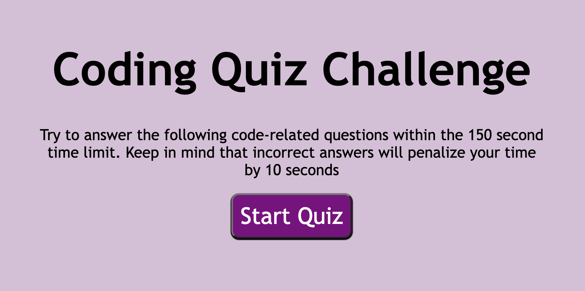

# 
CODE QUIZ

## The purpose of this project is to create a coding multiple choice quiz game
 
 

 

 ##  
CRITERIA

 

 - When the user clicks "start game" a series of questions should loop on the screen, one at a time.

 - Users were given a generous 150 seconds to complete a 25 HTML/CSS/Javascript quiz. If the quiz is not completed in the alloted time frame, the user is brought to the scores page. The user may enter their name or initials to save their score

 

# 
LINK TO THE CODING QUIZ: 

 

[MY CODING QUIZ](https://alessandrob96.github.io/codequiz/)

